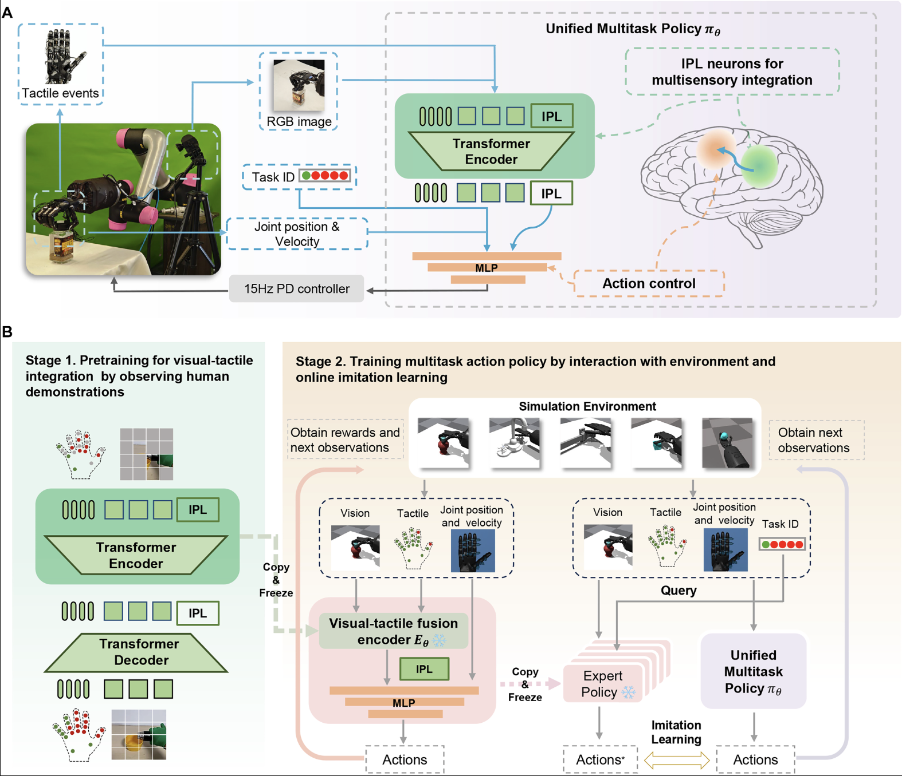

</img>

## two-stage-dexterity-learning (wip)

Explorations into the proposal from the paper, "Visual-tactile pretraining and online multitask learning for humanlike manipulation dexterity", from Zhejiang University

## Citations

```bibtex
@article{doi:10.1126/scirobotics.ady2869,
    author = {Qi Ye  and Qingtao Liu  and Siyun Wang  and Jiaying Chen  and Yu Cui  and Ke Jin  and Huajin Chen  and Xuan Cai  and Gaofeng Li  and Jiming Chen },
    title = {Visual-tactile pretraining and online multitask learning for humanlike manipulation dexterity},
    journal = {Science Robotics},
    volume = {11},
    number = {110},
    pages = {eady2869},
    year = {2026},
    doi = {10.1126/scirobotics.ady2869},
    URL = {https://www.science.org/doi/abs/10.1126/scirobotics.ady2869},
    eprint = {https://www.science.org/doi/pdf/10.1126/scirobotics.ady2869}
}
```
